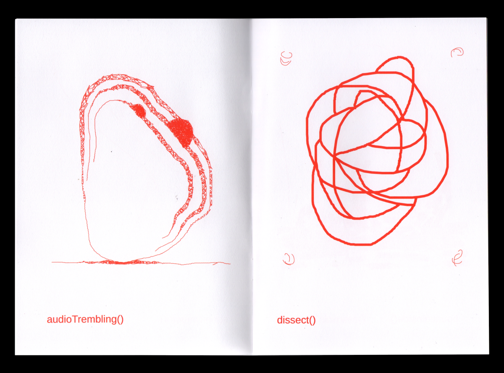
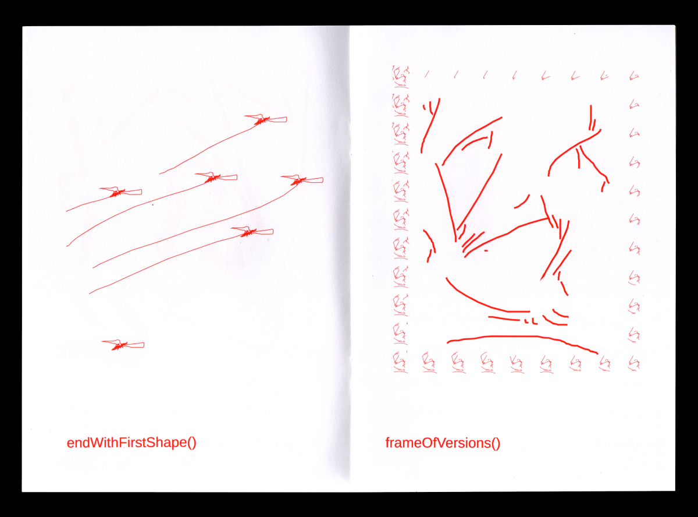

# Cool web & webtoprint projects

## Each Page A Function 
PROJET PAR: Raphaël Bastide  
DESCRIPTION: This publication combines drawing and programming by presenting 19 digital drawings made with 19 tools specially programmed for the project. 
Each program allows to reconsider the action of drawing by adding constraints or augmentation, but also temporal, spatial or formal behaviours.  
[LIEN VERS LE ZINE](https://raphaelbastide.com/epaf/zine/)     
[LEN VERS L'OUTIL](https://raphaelbastide.com/epaf/)   
[CODE SOURCE](https://gitlab.com/raphaelbastide/epaf/)    
 

## La bibliothèque web to print  
COLLECTE MENÉE PAR: Quentin Juhel et Lucile Haute  
S'inscrit dans l'initiative PREPOSTPRINT  
DESCRITPION: Une archive, mobile (entre écoles, bibliothèques et lieux d’expositions), réunissant des éditions imprimées réalisées avec des outils libres et web.  
[LIEN VERS LE SITE](http://2print.org/)     
