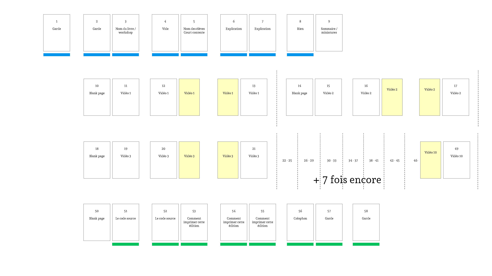

# Choix de fabrication

## Chemin de fer 

## Fabrication
### Formats 
* Format principal : 215mm x 155mm (à la française)
* Intercalaires : 215mm x 120mm

### Papiers
* Couverture : ?
* Introduction : Papier teinté dans la masse bleu (à définir)
* Conclusion : Papier teinté dans la masse vert (à définir)
* Contenu principal + intercalaires : Munken Linx Cream 150g/m2

### Reliures 
* Reliure Archives en plastique bleu

### Nombre d'exemplaires 
* 20 ?

Si on fait 16 éditions pendant le workshop 
64 A4 Bleu
64 A4 Vert
310 A4 Blanc 
