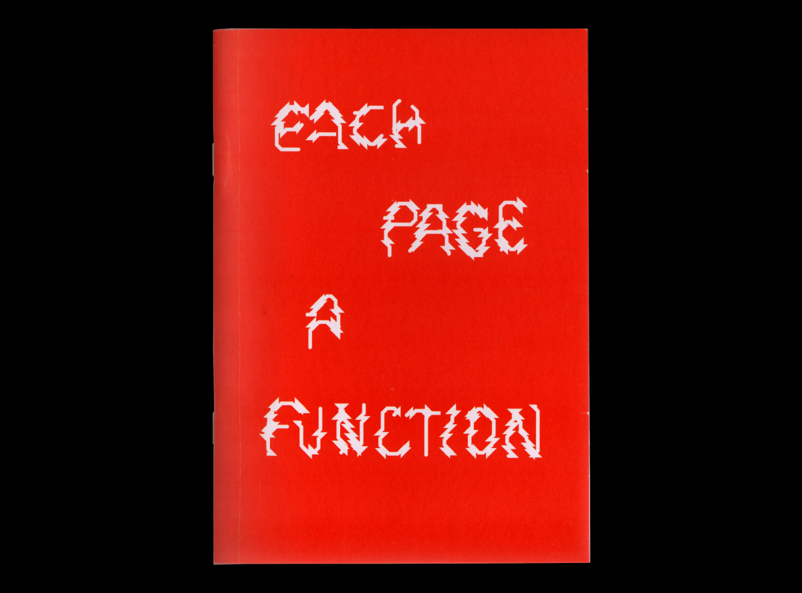
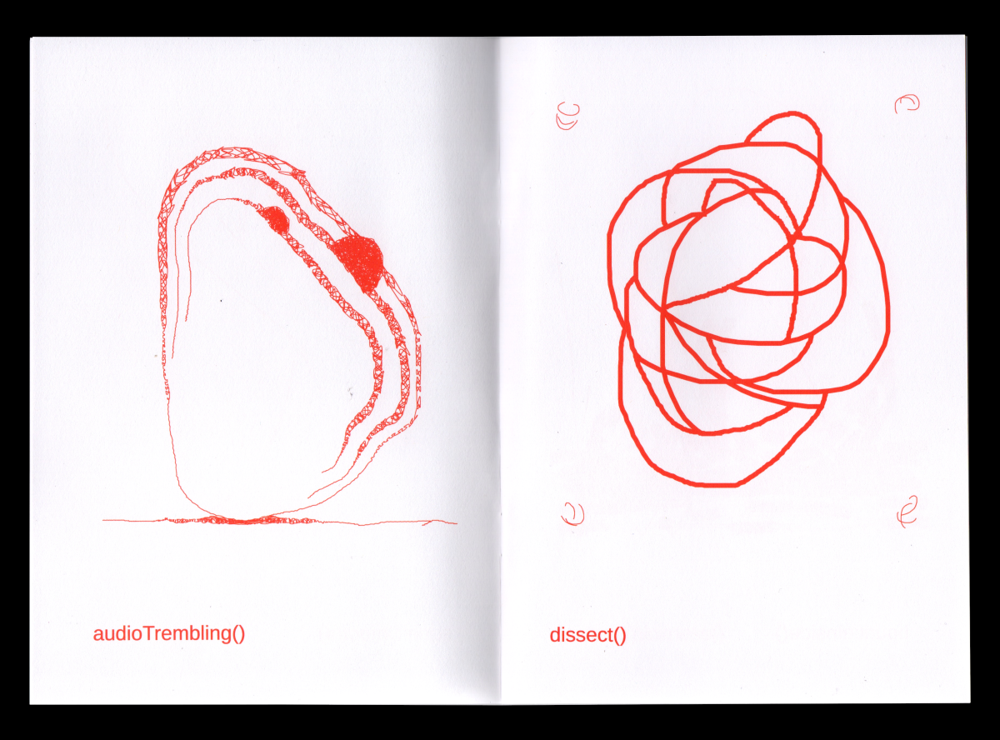
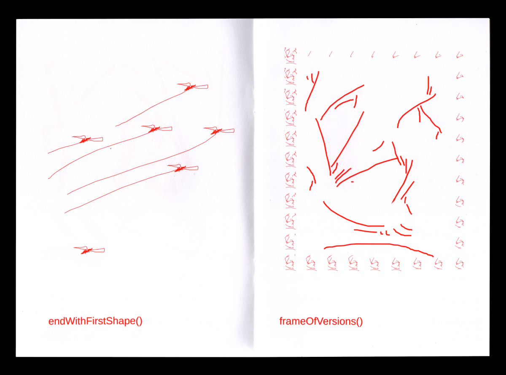
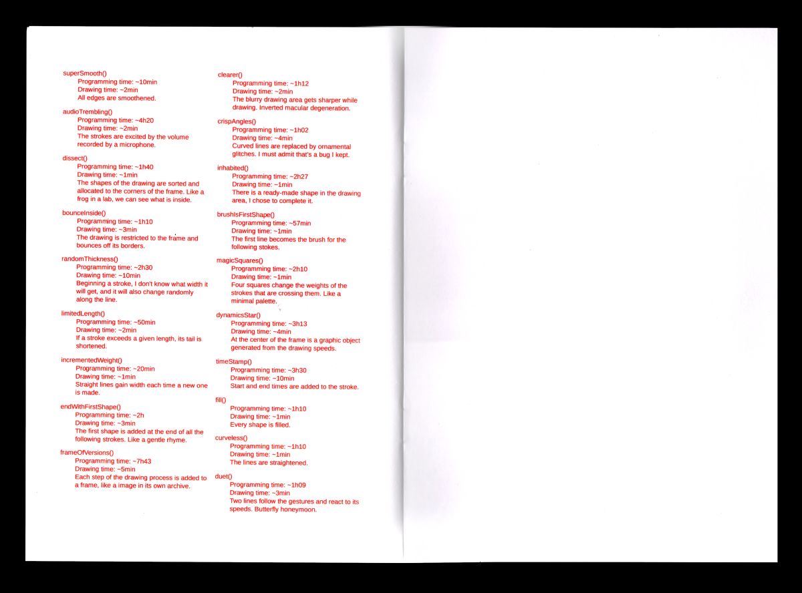
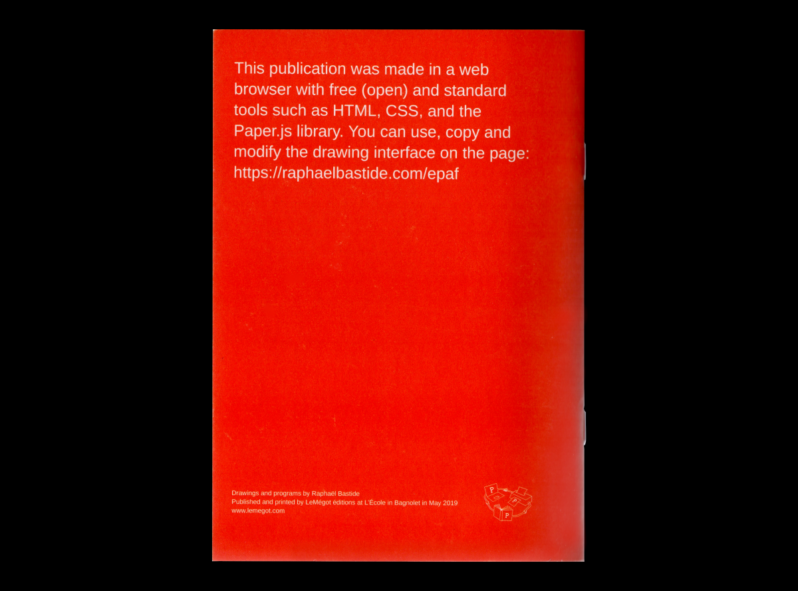

# Projets en web to print 

## A Party to print 
WORKSHOP MENÉ PAR: Sarah Garcin et Raphaël Bastide  
[LIEN VERS LA VERSION PDF](https://raphaelbastide.com/workshops/a-party-to-print/a-party-to-print_compressed.pdf)  
[LIEN VERS LA DOCUMENTATION](https://raphaelbastide.com/workshops/a-party-to-print/)  
IMAGES À AJOUTER 

 ## Code X 
PROJET PAR: Julie Blanc et Quentin Juhel  
DESCRIPTION: Le premier numéro du journal "Code X" a été publié à l'occasion de l'événement PrePostPrint des 20 et 21 octobre 2017 à la Gaîté Lyrique (Paris). Il a été entièrement conçu en HTML et CSS à partir d'un navigateur web. Les propriétés CSS region, CSS grid et CSS multicolumn ont été utilisées. Les fichiers sources du journal sont disponibles sur gitlab.  
[ÉDITION](https://www.editions-hyx.com/fr/code-x)  
[CODE SOURCE](https://gitlab.com/prepostprint/code-x-01)  
IMAGES À AJOUTER  

## Each Page A Function 
PROJET PAR: Raphaël Bastide  
DESCRIPTION: This publication combines drawing and programming by presenting 19 digital drawings made with 19 tools specially programmed for the project.
Each program allows to reconsider the action of drawing by adding constraints or augmentation, but also temporal, spatial or formal behaviours.  
[LIEN VERS LE ZINE](https://raphaelbastide.com/epaf/zine/)     
[LEN VERS L'OUTIL](https://raphaelbastide.com/epaf/)   
[CODE SOURCE](https://gitlab.com/raphaelbastide/epaf/)    
 

  

## Composer avec les technologies du web
PROJET PAR: Julie Blanc  
[VERSION PRINT À TÉLÉCHARGER](https://php.julie-blanc.fr/introduction.html)  
[LIEN VERS LA VERSION EN LIGNE](https://php.julie-blanc.fr/introduction.html)  
IMAGES À AJOUTER  

## Critical Atlas of the internet  
PROJET PAR: Louise Drulhe  
Pour son diplôme "Atlas critique d'Internet", Louise Drulhe a créé un livre qui possède une infinité de formats. Il s'agit d'un code informatique unique avec un nombre infini de possibilités d'affichage, à la fois en ligne (sites web, etc.) et sur papier. Dans une idée de responsive print, l'édition a un format adaptatif. Basée sur les règles d'impression CSS, la mise en page est générée automatiquement pour chaque nouveau format, et continuellement adaptée et réadaptée du livre au format de l'affiche.  
IMAGES À AJOUTER  

## Avoid Software  
PROJET PAR: Sarah Garcin, Emma Sizun et Quentin Juhel  
DESCRIPTION: Avoid Software est un fanzine geekos-punkos-utilos proposant des méthodes, scripts, hacks libres et open-source utiles à tout artiste, designer ou étudiant·e en école d’art et de design. Comment se passer des logiciels et utiliser des scripts pour toute action numérique ? Convertir des formats de fichiers, compresser un pdf, modifier des images, renommer des fichiers… Il présente également des programmes plus complexes et expérimentaux imaginés par des designers graphiques geekos et libristes. Il se décline en une version en ligne et en une version imprimée.  
[VERSION EN LIGNE](https://avoidsoftware.sarahgarcin.com/)  
IMAGES À AJOUTER  

## Les sculptures de la villa Chiragan  
PROJET PAR: Julie Blanc et Antoine Fauchié  
DESCRIPTION: Catalogue multi-support pour le musée Saint-Raymond (Toulouse). Les deux versions, imprimée et numérique, utilisent les technologies du web. Utilisation du principe du single source publishing pour la chaîne éditoriale.  
[DOCUMENTATION](https://julie-blanc.fr/projects/villa-chiragan/)  
[VERSION EN LIGNE](https://villachiragan.saintraymond.toulouse.fr/)  
[CODE SOURCE](https://gitlab.com/musee-saint-raymond/villa-chiragan)  
IMAGES À AJOUTER  

## Cityfab2.docs  
PROJET PAR: Amélie Dumont  
DESCRIPTION: Catalogue multi-support pour le musée Saint-Raymond (Toulouse). Les deux versions, imprimée et numérique, utilisent les technologies du web. Utilisation du principe du single source publishing pour la chaîne éditoriale.  
[LIEN VERS LE SITE DE AMÉLIE](https://www.amelie.tools/)  
IMAGES À AJOUTER  

## Graphisme en France 2022  
MIS EN PAGE PAR: F451  
DESCRIPTION: Dans l’ouvrage, les 3 textes explorent la question des outils du designer graphique donc F451 a décidé d’uitliser des outils de mise en page différents pour chacune des parties (dont Paged.js et Libre Office).  
[INTERVIEW](https://www.youtube.com/watch?v=MtT-GbxU4r4)  
IMAGES À AJOUTER  
